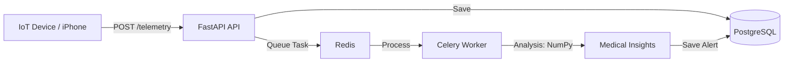

# Vital Telemetry Engine

A high-performance, asynchronous medical telemetry processing engine designed for real-time health monitoring and anomaly detection.

## 🚀 Overview

Vital Telemetry Engine is a scalable backend solution for medical IoT devices (wearables, sensors, smartwatches). It processes high-frequency health metrics (Heart Rate, SpO2) through an asynchronous pipeline, performing real-time signal analysis and anomaly detection.

### Key Features

- **Asynchronous API**: Built with **FastAPI** for high-concurrency data ingestion.
- **Distributed Processing**: Uses **Redis** as a message broker and **Celery** for background medical analysis.
- **Signal Analysis**: Implements **NumPy** algorithms to calculate Heart Rate Variability (HRV) and Stress Indices.
- **Medical Context**: Domain-driven data models for Patients, Physicians, and Time-series telemetry.
- **Observability**: Structured JSON logging ready for **ELK/Loki/Grafana** stacks.
- **IoT Ready**: Includes adapters for **Apple Health (Webhooks)** and patterns for **Bluetooth Low Energy (BLE)** integration.
- **Containerized**: Fully orchestrated with **Docker Compose**.

## 🛠 Tech Stack

- **Language**: Python 3.11+ (Asyncio)
- **Framework**: FastAPI
- **Database**: PostgreSQL + SQLAlchemy (Async)
- **Task Queue**: Celery + Redis
- **Data Science**: NumPy
- **DevOps**: Docker, Docker Compose

## 🏗 Architecture



## 🚦 Getting Started

### Prerequisites
- Docker & Docker Compose
- Python 3.11+ (for local simulation)

### Installation

1. **Clone the repository:**
   ```bash
   git clone https://github.com/xadazhii/vital-telemetry-engine.git
   cd vital-telemetry-engine
   ```

2. **Start the infrastructure:**
   ```bash
   docker compose up -d --build
   ```

3. **Access the Dashboard:**
   Open `http://localhost:8000/dashboard` to view real-time data.

4. **Run Device Simulator:**
   ```bash
   python3 simulate_device.py
   ```

## 🔌 API Integration

- **Swagger UI**: `http://localhost:8000/docs`
- **Apple Health Webhook**: `POST /telemetry/apple-health` (Compatible with Health Auto Export app)

## 🩺 Medical Logic

The system analyzes heart rate patterns using a sliding window of the last 10 samples to calculate:
- **HRV**: Standard deviation of inter-beat intervals.
- **Stress Index**: Categorized based on heart rate variability.
- **Signal Confidence**: Detection of sensor noise or erratic signals.

---
*Developed for high-fidelity medical monitoring and real-time intervention.*
